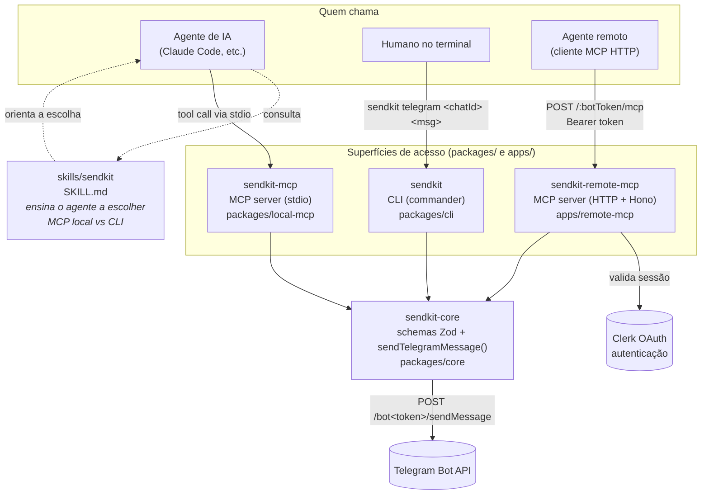

# SendKit

**SendKit** é um monorepo TypeScript que expõe uma única operação — enviar mensagens no Telegram — através de três superfícies diferentes (CLI, servidor MCP local e servidor MCP remoto), todas apoiadas em um único pacote `core` que fala com a Telegram Bot API.

A ideia central: **uma lógica, três formas de chegar até ela.** Um agente de IA usa o MCP local via stdio; outro agente, rodando remotamente, usa o MCP via HTTP autenticado com OAuth; um humano no terminal usa a CLI. Todos batem no mesmo `sendTelegramMessage`.

---

## Arquitetura



### Fluxo por superfície

| Superfície | Quem usa | Transporte | Origem do bot token |
|---|---|---|---|
| **`sendkit-mcp`** (local) | Agentes de IA (preferencial) | MCP via stdio | Variável de ambiente `TELEGRAM_BOT_TOKEN`, injetada pelo cliente MCP |
| **`sendkit`** (CLI) | Humano no terminal, fallback do agente | Comando de shell | Arquivo local `~/.config/sendkit/config.json` (modo `0600`), gravado por `sendkit init` |
| **`sendkit-remote-mcp`** | Agentes remotos / integrações HTTP | MCP via HTTP (Hono), autenticado | Path da URL (`/:botToken/mcp`), request autenticada via Clerk (OAuth Bearer) |

Todas as três chamam a mesma função (`sendTelegramMessage` em `packages/core`), que valida a entrada com Zod, chama a Telegram Bot API e devolve `{ ok: true, chatId, messageId }`.

---

## Estrutura do repositório

```
sendkit/
├── packages/
│   ├── core/            @renatomardev-org/sendkit-core
│   │   └── src/
│   │       ├── schemas.ts      # validação Zod (input/output, request/response da API)
│   │       └── operations.ts   # sendTelegramMessage()
│   │
│   ├── cli/              @renatomardev-org/sendkit  (bin: sendkit)
│   │   └── src/index.ts        # comandos `init` e `telegram` (commander)
│   │
│   └── local-mcp/        @renatomardev-org/sendkit-mcp  (bin: sendkit-mcp)
│       └── src/index.ts        # servidor MCP stdio, tool `telegram`
│
├── apps/
│   └── remote-mcp/       sendkit-remote-mcp
│       └── src/index.ts        # servidor MCP HTTP (Hono) com auth Clerk
│
├── skills/
│   └── sendkit/SKILL.md        # instrui agentes (Claude Code) a usar MCP vs CLI
│
└── .agents/skills/              # skills auxiliares (ex.: skill-creator)
```

É um monorepo gerenciado com **Bun workspaces** (`workspaces: ["apps/*", "packages/*"]`).

---

## Pacotes

### `@renatomardev-org/sendkit-core`
Sem dependência de I/O além do `fetch` para a Telegram Bot API. Define os schemas Zod que todas as outras superfícies reutilizam e a função `sendTelegramMessage(input)`, que:
1. valida `{ chatId, message, botToken }`;
2. faz `POST https://api.telegram.org/bot<token>/sendMessage`;
3. valida a resposta e retorna `{ ok: true, chatId, messageId }` ou lança erro com a `description` da API.

### `@renatomardev-org/sendkit` (CLI)
```bash
sendkit init --telegram-bot-token <botToken>   # grava token em ~/.config/sendkit/config.json (0600)
sendkit telegram <chatId> <message>            # envia e imprime o JSON do resultado
```

### `@renatomardev-org/sendkit-mcp` (MCP local)
Servidor MCP via stdio (`@modelcontextprotocol/sdk`), expõe a tool `telegram`. Pensado para ser o modo **preferencial** de um agente enviar mensagens — não abre shell, o token vem do ambiente do cliente MCP (`TELEGRAM_BOT_TOKEN`).

### `sendkit-remote-mcp` (MCP remoto)
Servidor HTTP (Hono) que expõe o mesmo tool `telegram` via Streamable HTTP, multi-tenant: o bot token viaja no path da URL (`/:botToken/mcp`) e cada request é autenticada por OAuth Bearer token validado contra o **Clerk**, com metadata de recurso protegido publicada em `/.well-known/oauth-protected-resource/:botToken/mcp`.

### `skills/sendkit`
Skill do Claude Code que ensina um agente a preferir o MCP local, cair para a CLI quando o MCP não está conectado, e como validar manualmente que o envio funcionou.

---

## Como rodar localmente

Pré-requisitos: [Bun](https://bun.sh).

```bash
bun install

# CLI
bun run dev:cli -- telegram <chatId> "mensagem de teste"

# MCP local (stdio)
bun run dev:local-mcp

# MCP remoto (HTTP)
bun run dev:remote-mcp
```

### Build

```bash
bun run build:core
bun run build:cli
bun run build:local-mcp
```

### Qualidade

```bash
bun run typecheck
bun run lint
bun run format:check
```

---

## Configuração

Nenhuma credencial fica no repositório — os arquivos que carregam segredos (`.env`, `.mcp.json`, `opencode.json`) estão no `.gitignore`. Configure localmente a partir dos exemplos:

| Superfície | Onde configurar | Variável / arquivo |
|---|---|---|
| MCP local / remoto (dev) | `.env` (veja `.env.example`) | `TELEGRAM_BOT_TOKEN` |
| MCP remoto | ambiente do processo | `CLERK_PUBLISHABLE_KEY`, `CLERK_SECRET_KEY`, `PORT` |
| CLI | `~/.config/sendkit/config.json` | gerado por `sendkit init --telegram-bot-token <token>` |
| Cliente MCP (ex. Claude Code) | `.mcp.json` local (não versionado) | `TELEGRAM_BOT_TOKEN` no bloco `env` do server `sendkit` |

---

## Stack

- **Runtime/monorepo:** Bun (workspaces), TypeScript
- **Validação:** Zod
- **CLI:** Commander
- **MCP:** `@modelcontextprotocol/sdk` (stdio e Streamable HTTP)
- **Servidor HTTP remoto:** Hono
- **Auth remota:** Clerk (`@clerk/backend`, `@clerk/mcp-tools`)
- **Build:** tsdown
- **Lint/format:** oxlint / oxfmt

---

## Licença

Ainda não definida neste repositório.
